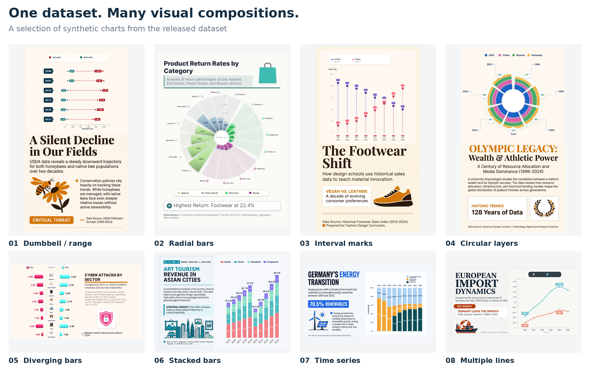
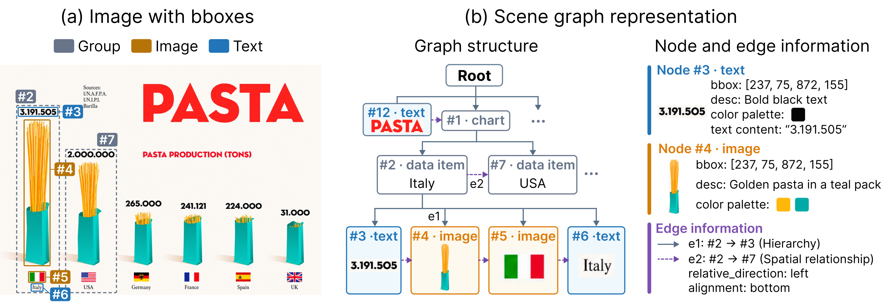
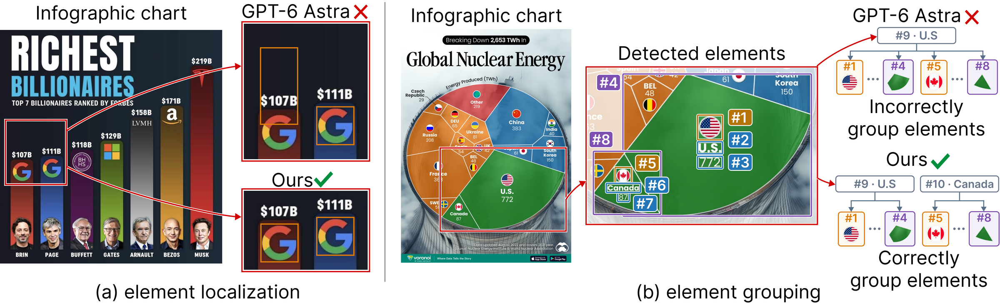
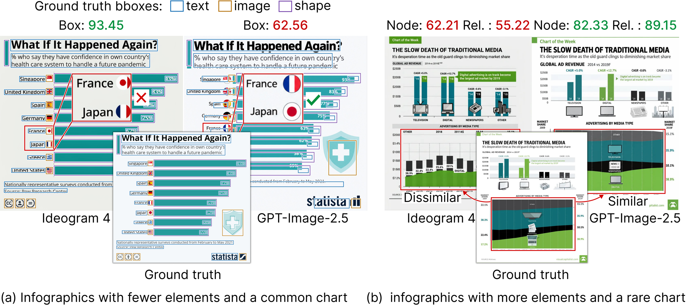

<h1 align="center">ChartGalaxy++</h1>

<strong>A Richly Annotated Dataset for Chart Understanding and Generation</strong>

  <a href="https://huggingface.co/datasets/ChartGalaxyPP/ChartGalaxyPlusPlus">Dataset</a> &nbsp; · &nbsp;
  <a href="https://huggingface.co/ChartGalaxyPP/ChartGalaxyPlusPlus-Image2SceneGraph">Image2SceneGraph model</a> &nbsp; · &nbsp;
  <a href="https://github.com/ChartGalaxyPP/ChartGalaxyPlusPlus/releases/tag/v1.0">Application data</a>

**ChartGalaxy++ connects what is in an infographic chart with how it is organized.** Each chart is paired with a scene graph: visual elements and semantic groups form the nodes, while hierarchical and spatial relationships connect them. These annotations support chart structure prediction, visual question answering, and evaluation of image generation.

| Infographic charts | Annotated nodes | Relationships |
| :---: | :---: | :---: |
| **217,195** | **18.90 million** | **39.99 million** |

## Explore the dataset

*Selected synthetic examples from the released PNGs, shown in full. The gallery spans compact comparisons, layered circular charts, dense radial marks, and illustrated narratives. [View at full resolution](assets/gallery.png) · [Sample identities](assets/sources.json)*

## What is annotated?

*The pasta-production example from the paper: each country groups a value, a pasta image, a flag, and a country label. The scene graph records these groups, element attributes, and hierarchical and spatial relationships. [Enlarge](assets/annotation.png)*

| Layer | Annotation content |
| --- | --- |
| **Visual elements** | Text, images, and shapes with bounding boxes, semantic roles, text content, and appearance attributes |
| **Semantic groups** | Charts, axes, legends, legend items, data items, series, and panels |
| **Hierarchy** | Parent–child links connecting elements to groups and the chart composition |
| **Spatial relationships** | Relative position, alignment, overlap, and Boolean proximity (`is_near`) |

See the [annotation guide](docs/ANNOTATION_GUIDE.md), [JSON schema](docs/scene_graph.schema.json), and [data format](docs/DATA_FORMAT.md) for the complete representation.

## Three applications

### 1. Image-to-scene-graph prediction

**Recover the structure behind an infographic.** Image2SceneGraph, fine-tuned from the Qwen3.5-4B family, predicts visual elements, semantic groups, and their hierarchy. On the 1,000-chart test set it achieves **89.4% node F1, 85.1% hierarchy F1, and 88.0% spatial F1**, compared with 76.0%, 50.3%, and 72.5% for GPT-6 Astra under the same evaluation protocol.

*Qualitative examples from the paper: separating nearby elements and assigning marks to the correct group.*

[Download the model](https://huggingface.co/ChartGalaxyPP/ChartGalaxyPlusPlus-Image2SceneGraph) · [Inference guide](https://huggingface.co/ChartGalaxyPP/ChartGalaxyPlusPlus-Image2SceneGraph/blob/main/INFERENCE.md) · [Results for all 11 models](applications/image_to_scene_graph/paper_table.json) · [Benchmark package](https://github.com/ChartGalaxyPP/ChartGalaxyPlusPlus/releases/download/v1.0/image-to-scene-graph.tar.gz)

### 2. Scene-graph-augmented question answering

**Connect a question to the right visual evidence.** Scene graphs make associations between labels, values, and graphical marks explicit. The QA benchmark contains **1,266 questions on 1,000 charts**. For example, the paper reports Gemma 4-12B-IT improving from **40.2% to 67.4% accuracy** with scene graphs compared with evidence-guided image prompting.

| Model | Evidence-guided image prompting | With scene graph |
| --- | ---: | ---: |
| Gemma 4-12B-IT | 40.2% | **67.4%** |
| Qwen3.8-27B | 76.9% | **86.9%** |
| GPT-5.6 Sol | 85.1% | **91.6%** |
| GPT-6 Astra | 94.0% | **97.6%** |

[Browse the questions](applications/qa/questions.json) · [Download questions, answers, and original images](https://github.com/ChartGalaxyPP/ChartGalaxyPlusPlus/releases/download/v1.0/qa.tar.gz) · [QA package details](docs/QA.md)

### 3. Scene graph preservation in image generation

**Measure whether a generated infographic preserves its intended structure.** The benchmark evaluates element attributes and relationships across **11 image-generation models on 1,000 chart inputs**. Released materials include prompts, references, predictions, scores, **10,949 generated images**, and 51 recorded failures.

*Qualitative comparisons from the paper, covering both simpler compositions and denser chart structures.*

[Benchmark details](applications/scene_graph_preservation/README.md) · [Model results](applications/scene_graph_preservation/paper_table.json) · [Download outputs](https://github.com/ChartGalaxyPP/ChartGalaxyPlusPlus/releases/tag/v1.0)

## Download and use

| Resource | Where to start |
| --- | --- |
| **Main dataset** | [Hugging Face](https://huggingface.co/datasets/ChartGalaxyPP/ChartGalaxyPlusPlus) · [Load a sample](docs/USAGE.md) · [Data format](docs/DATA_FORMAT.md) |
| **Image2SceneGraph model** | [Weights and model card](https://huggingface.co/ChartGalaxyPP/ChartGalaxyPlusPlus-Image2SceneGraph) · [Local inference](https://huggingface.co/ChartGalaxyPP/ChartGalaxyPlusPlus-Image2SceneGraph/blob/main/INFERENCE.md) |
| **Three application packages** | [GitHub Release v1.0](https://github.com/ChartGalaxyPP/ChartGalaxyPlusPlus/releases/tag/v1.0) · [Package contents](docs/BENCHMARKS.md) |

| Split | Real charts | Synthetic charts | Total |
| --- | ---: | ---: | ---: |
| Train | 56,244 | 159,951 | 216,195 |
| Test | 500 | 500 | 1,000 |
| **Total** | **56,744** | **160,451** | **217,195** |

**Real charts: URLs + annotation JSON. Synthetic charts: PNG + annotation JSON.** The main dataset is distributed in 926 independently extractable `tar.gz` shards. `sample_index.jsonl.gz` maps each sample ID to its shard and member files. The separate QA package includes its original images.

Exact annotation counts and release notes

- **Nodes:** 15,591,656 visual elements + 3,088,632 explicit groups + 217,195 implicit roots = 18,897,483.
- **Relationships:** 18,680,288 parent links + 21,308,862 stored spatial records = 39,989,150. Each chart stores at most 100 spatial records; unrecorded pairs are not negative labels.
- `is_near` is Boolean. Positive-area overlaps and containment are excluded; both absolute and relative distance thresholds must hold. The format guide specifies the rule.
- Annotations are model-produced (`human_gold: false`); the release does not claim that every chart has been independently verified by a human.
- Generated replacement illustrations and their affected annotations are included in the main dataset. Historical benchmark packages retain the identities of their evaluated inputs; use their supplied references when inspecting reported results.
- Real-image references are supplied without checking their current availability. Source pages, direct image URLs, and archive references are distinguished in the format guide.

The application packages provide data, saved outputs, and documentation. QA includes questions, answers, and images; model responses and detailed scoring materials are not included. Annotation, training, evaluation, and review pipeline implementations are not part of this release.

## License

Contributed annotations and Image2SceneGraph fine-tuning contributions are released under **CC BY-NC 4.0**. Third-party chart content and required upstream attributions retain their respective rights. See [license and sources](docs/LICENSE_AND_SOURCES.md) and the [model license notice](https://huggingface.co/ChartGalaxyPP/ChartGalaxyPlusPlus-Image2SceneGraph/blob/main/NOTICE.md).
