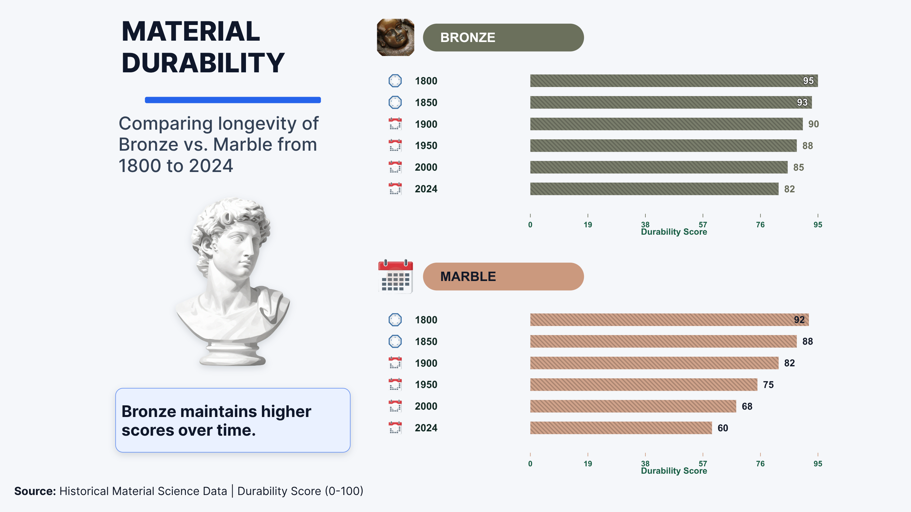

# ChartGalaxy++

Scene graph annotations for **217,195 infographic charts**, containing **18,897,483 nodes** and **39,989,150 relationships**.

[Project and application data](https://github.com/ChartGalaxyPP/ChartGalaxyPlusPlus) · [Image2JSON model](https://huggingface.co/ChartGalaxyPP/ChartGalaxyPlusPlus-Image2JSON) · [Data format](docs/DATA_FORMAT.md) · [Loading guide](docs/USAGE.md)

| Chart source | Train | Test | Download contents |
| --- | ---: | ---: | --- |
| Real | 56,244 | 500 | URLs and annotation JSON; no image binaries |
| Synthetic | 159,951 | 500 | PNG and annotation JSON |
| Total | 216,195 | 1,000 | |

The 926 downloadable `tar.gz` shards contain **one JSON file per chart** and a same-stem PNG for each synthetic chart. `sample_index.jsonl.gz` maps sample IDs to shard and member names. The original split membership and IDs are retained. The main dataset is hosted on Hugging Face; the separate QA package includes its original evaluated images.

There are **15,591,656 visual elements**, **3,088,632 groups**, and **217,195 implicit roots**. Relationships comprise **18,680,288 parent links** and **21,308,862 stored spatial records**. Each chart stores at most 100 spatial records. Proximity is Boolean `is_near`; overlapping boxes are not near, and both the absolute and relative distance thresholds must hold.

Layout illustrations have received generated replacement assets. Their boxes, appearance descriptions, affected group attributes, and stored spatial relations were updated with the released PNGs. Icons are retained. Historical benchmark packages identify their evaluated inputs by hash; changed images must not be substituted for those inputs.

Annotations are model-produced (`human_gold: false`). Structural and content-integrity checks are not a claim that every annotation was verified by a human. Available real-image URLs and archive references are supplied without checking their current availability.

Contributed annotations use **CC BY-NC 4.0**. Third-party chart content and required upstream license attributions retain their respective rights. See [license and sources](docs/LICENSE_AND_SOURCES.md). Annotation, training, evaluation, and review pipeline code is outside this release.

## Applications

[Benchmark downloads](docs/BENCHMARKS.md) include image-to-scene-graph results, 1,266 QA questions and their original images, and scene graph preservation outputs. The [Image2JSON guide](docs/IMAGE2JSON.md) describes the released model.
